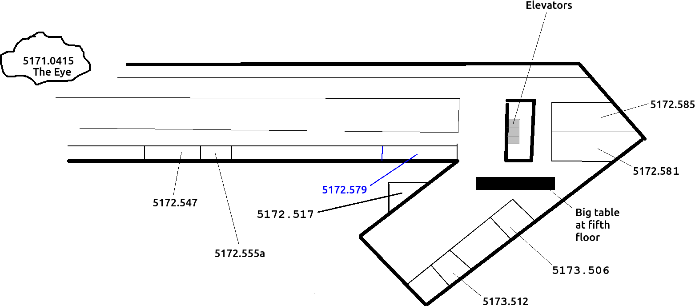

# internship_aram

Internship of Aram at the Rijksuniversiteit Groningen.

## Info

 * When:
    * Monday March 16th to and including Friday March 20th (one week)
    * Monday May 4th to and including Friday May 15th (two weeks week),
      exluding May 5th, due to Liberation Day
 * Building: [Linnaeusborg](https://www.rug.nl/staff/location/5172), Nijenborgh 7, 9747 AG Groningen
 * Rooms:
    * Canteen, at ground floor
    * Theoretical Biological department, mostly at 5th floor

## Questions for supervisors

### Who is Aram?

Aram is a 14 year old scholar,
that follows Richel's programming course.
He has been the one improving the documentation of the game Nature Zen.

### What should I do during my slot

You can fill the time in any way you like.

Perhaps the most useful thing to do,
is to explain your work to the intern,
to verify that that you can (still) explain your scientific work to laymen.

Consider:

 * telling/showing your work
 * teaching some basic biology
 * showing some code/scripts 
 * show the lab/campus/Peregrine/etc
 * taking a walk

### A slot of 45 minutes is too long for one person

Slots can also be filled with more than one person :wink:

### Aaah! I cannot be there! What should I do?

It's fine. Just let Richel, Aram or any colleague know. 
We'll find a solution :+1:

### What is the goal of the internship?

To learn how working at a university is like.

### What will the intern deliver?

[To be determined]

