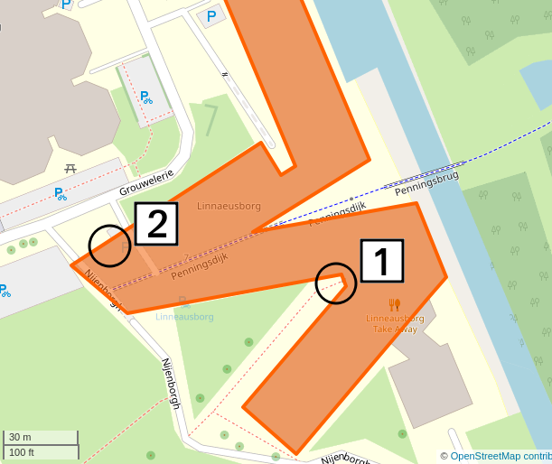

# internship_aram

Internship of Aram at the Rijksuniversiteit Groningen.

## Info

 * When:
    * Monday November 23rd to and including Friday December 4th (two weeks)
 * Building: 
    * [Linnaeusborg](https://www.rug.nl/staff/location/5172), Nijenborgh 7, 9747 AG Groningen
 * Rooms:
    * Mostly online
    * Molecular Immunology (MOLIMM), mostly at 6th floor at West side of LB
 * Working hours: 8:30-16:00

> Map of the Linneausborg. [1] main entrance [2] MOLIMM corner, 5171.06xx

## Deliverables

A [report](report.md)

## Planning

## Monday November 23rd 2020

Time       |What                                    |Where
-----------|----------------------------------------|-------------------------------------------------
 8:30-9:00 |Meeting Richel                          |Discord
 9:00-10:00|MOLIMM meeting                          |`https://meet.google.com/???-????-cez`
10:00-11:00|MOLIMM informal meeting                 |`https://meet.google.com/???-????-mzm`
12:30-13:00|Meeting with Anmara                     |5171.070? (aka The Secretary's Office)
13:00-14:00|Meeting with Pieter                     |5171.0606
14:00-15:00|Meeting with Hugo                       |5171.0626 (aka The Student Room)
15:45-16:00|Meeting Richel                          |Discord

## Tuesday November 24th 2020

Time       |What                                    |Where
-----------|----------------------------------------|-------------------------------------------------
 8:30-8:40 |Meeting Richel                          |Discord
13:00-14:00|Meeting with Jelleke                    |5171.0626 (aka The Student Room)
14:00-15:00|Meeting with Jildau                     |5171.0626 (aka The Student Room)
15:50-16:00|Meeting Richel                          |Discord

## Wednesday November 25th 2020

Time       |What                                    |Where
-----------|----------------------------------------|-------------------------------------------------
 8:30-8:35 |Meeting Richel                          |Discord
13:00-14:00|Meeting with Shweta                     |5171.0603
14:00-15:00|Meeting with Marco                      |5171.0626 (aka The Student Room)
15:55-16:00|Meeting Richel                          |Discord

## Thursday November 26th 2020

Time       |What                                    |Where
-----------|----------------------------------------|-------------------------------------------------
13:00-14:00|Meeting with Felix                      |5171.603
14:00-15:00|?Meeting with ?Myrthe                   |5171.6??

## Friday November 27th 2020

Time       |What                                    |Where
-----------|----------------------------------------|-------------------------------------------------
13:00-14:00|Meeting with Sjors                      |5171.604
14:00-15:00|Meeting with Femmy                      |5171.60?

## Monday November 30th 2020

Time       |What                                    |Where
-----------|----------------------------------------|-------------------------------------------------
 9:00-10:00|Cell biology meeting                    |`https://meet.google.com/???-????-dbq`
10:00-11:00|MOLIMM informal meeting                 |`https://meet.google.com/???-????-mzm`
13:00-14:00|?Meeting with ?Femmy/?Myrthe            |5171.6??
14:00-15:00|?Meeting with ?Femmy/?Myrthe            |5171.6??

## Tuesday December 1st 2020

Time       |What                                    |Where
-----------|----------------------------------------|-------------------------------------------------
13:00-14:00|?Meeting with ?Alexine/?Femmy/?Myrthe   |5171.6??
14:00-15:00|?Meeting with ?Alexine/?Femmy/?Myrthe   |5171.6??

## Wednesday December 2nd 2020

Time       |What                                    |Where
-----------|----------------------------------------|-------------------------------------------------
13:00-14:00|?Meeting with postdoc                   |5171.6??
14:00-15:00|?Meeting with postdoc                   |5171.6??

## Thursday December 3rd 2020

Time       |What                                    |Where
-----------|----------------------------------------|-------------------------------------------------
13:00-14:00|?Meeting with postdoc                   |5171.6??
14:00-15:00|?Meeting with postdoc                   |5171.6??

## Friday December 4th 2020

Time       |What                                    |Where
-----------|----------------------------------------|-------------------------------------------------
8:30-9:30  |No work yet                             |At home
15:14      |Hand in report                          |On GitHub
15:14-15:30|Evaluate                                |Area near coffee machine
15:30-16:30|Meeting with prof                       |5171.6?? (aka Geerts's office)

## Questions for supervisors

### Who is Aram?

Aram is a 15 year old scholar,
that follows Richel's programming course.

Some of his projects:

 * [Nature Zen](https://github.com/richelbilderbeek/djog_unos_2018)
 * [Tank Battalion](https://github.com/djog/djog_unos_2020)

Or how Aram would describe himself:

> Hey! So this is me. I don't know what to put here because i don't know what has been said about me already.
> Short introduction just in case,
> I'm Aram,
> 15 years old,
> Year 3 on the Montessori Vaklyceum,
> I love computers and helping others,
> I can work alone pretty well.
> 
> Any questions about me or anything, just ask

### What should I do during my slot

You can fill the time in any way you like.

Perhaps the most useful thing to do,
is to explain your work to the intern,
to verify that that you can (still) explain your scientific work to laymen.

Consider:

 * telling/showing your work
 * teaching some basic biology
 * showing some code/scripts 
 * show the lab/campus/Peregrine/etc
 * taking a walk

### A slot of 45 minutes is too long for one person

Slots can also be filled with more than one person :wink:

### Aaah! I cannot be there! What should I do?

It's fine. Just let Richel, Aram or any colleague know. 
We'll find a solution :+1:

### What is the goal of the internship?

To learn how working at a university is like.

### What will the intern deliver?

A [report](report.md).

