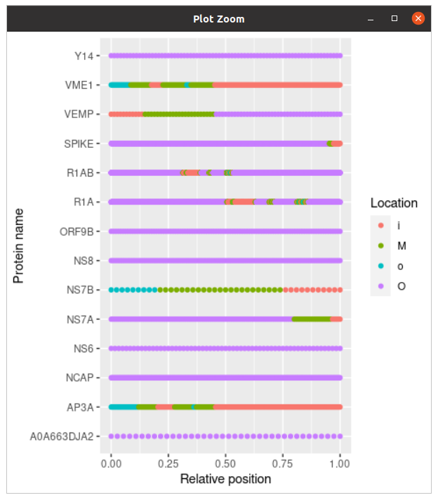
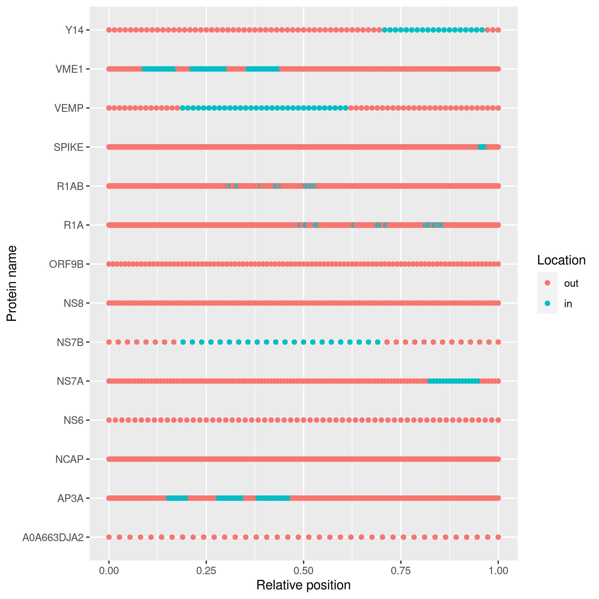

# Topology prediction in SARS-CoV-2 membrane proteins

Guidelines:

 * Problem:
    * We know the sequence of SARS-CoV-2
    * SARS-CoV-2 encodes some membrane proteins
    * I assume we know the topology of these
    * I know we can predict the topology from the sequence
    * Do reality and predictions match?
 * Language: formal English, avoid 'I did X to determine Y', 
   use 'Y was determined by doing X' instead
 * References:
    * No need for references if common and true knowledge (e.g. DNA contains the
      heritable material for a cell)
    * For things that may be true or false, refer the the literature
    * When in doubt, use a reference. Wikipedia is not a reference, but it does
      refer to the academic literature.   
 * Remove these guideline and comments in square brackets for the final versiom

## Introduction

[Tell what is known and why it is important]
[Tell what is missing and why it is important to add]
[Give all info needed for a reader to understand the hypothesis. When in doubt: remove]

## Hypothesis

[Modify to proper English]

 * The topology prediction by TMHMM [Sonnhammer et al., 1998; Krogh et al., 2001]
   for the SARS-CoV-2 membrane proteins matches reality
 * The topology prediction by PureseqTM [Wang et al., 2019]
   for the SARS-CoV-2 membrane proteins matches reality

## Methods

[Describe how to hypoteses are proven or disproven]

## Results

[Show the results in figures/tables/text]

## Conclusion

[Interpret the results: are the hypotheses true or false?]

## Discussion

[What are the flaws in this research? Note: 'lack of time' is not a flaw, 
an unfinished/messy story is]

## References

 * [Krogh et al., 2001] 
   A. Krogh, B. Larsson, G. von Heijne, and E. L. L. Sonnhammer.
   Predicting transmembrane protein topology with a hidden Markov model: 
   Application to complete genomes.
   Journal of Molecular Biology, 305(3):567-580, January 2001.
 * [Sonnhammer et al., 1998] 
   E.L.L. Sonnhammer, G. von Heijne, and A. Krogh.
   A hidden Markov model for predicting transmembrane helices 
   in protein sequences.
   In J. Glasgow, T. Littlejohn, F. Major, R. Lathrop, D. Sankoff, 
   and C. Sensen, editors, 
   Proceedings of the Sixth International Conference 
   on Intelligent Systems for Molecular Biology, 
   pages 175-182, Menlo Park, CA, 1998. AAAI Press.
 * [Wang et al., 2019] 
   Q. Wang et al. 
   "Efficient and accurate prediction of transmembrane topology from amino acid sequence only." 
   bioRxiv (2019): 627307.

